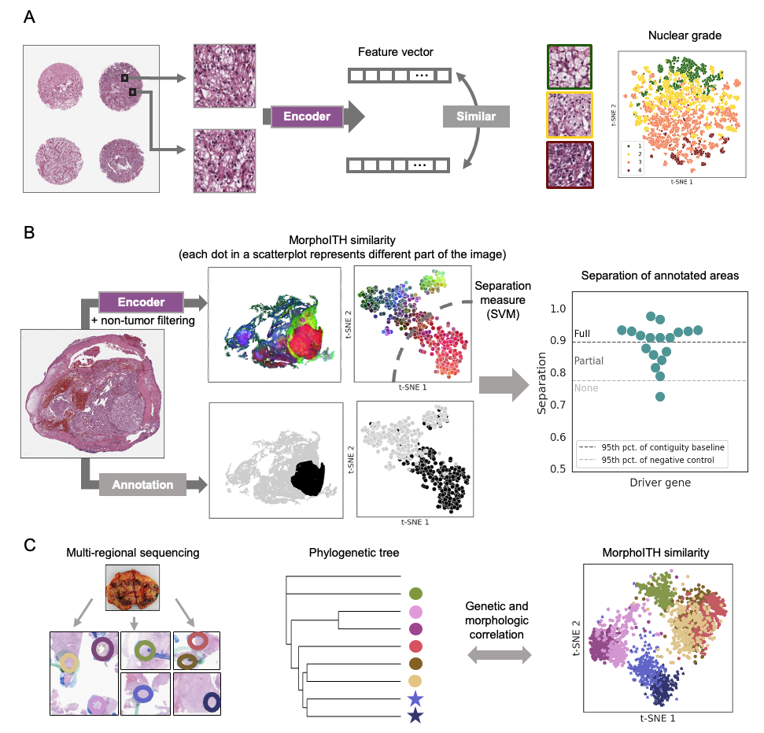

# MorphoITH: A Framework for Deconvolving Intra-Tumor Heterogeneity Using Tissue Morphology



Code for the paper [MorphoITH: A Framework for Deconvolving Intra-Tumor Heterogeneity Using Tissue Morphology](https://doi.org/10.1186/s13073-025-01504-x) by Nielsen A. W. et al.

## Summary
MorphoITH, our framework for deconvolving intra-tumor heterogeneity in  cell renal cell carcinoma (ccRCC), consists of (a) a self-supervised deep learning similarity measure to capture the phenotypic variation across cytology, microenvironment and tumor architecture, rather than relying on pre-defining morphologies, and (b) analyses for quantifying how the spatial variation of specific traits of interests covaries with morphology. We use this framework to relate morphology to spatial genetic heterogeneity in key driver genes (*BAP1*, *PBRM1*, *SETD2*), and to explore the changes in morphology with tumor evolution using multi-region sequencing experiments on patients where we find a strong relationship with genetic and morphologic similarity.

## Instructions
The code provided here describes: (1) data generation, (2) encoder training, (3) inference to generate image features, (4) downstream analyses, (5) saved figures, (6) utility scripts.

| Action    | Description | Documentation |
| -------- | ------- |------- |
| 1. Data generation  | Code to generate patches from H&E images, and   morphological clusters from feature profiles. | [Data](Data_Generation/README.md)|
| 2. Model training | Training pipelines for  variations of encoders compared in the paper. |[Training](Model_Training/README.md)|
| 3. Model inference    | Code to generate feature profiles per patch or via tessellation. |[Inference](Model_Inference/README.md)|
| 4. Analyses    | All analyses done in the paper to explore the framework's usage.  |[Analyses](Analyses/README.md)|
| 5. Figures | Jupyter Notebook with figures generated for the paper. |[Figures](Figures.ipynb)
| 6. Utils | Additional scripts and parameters. |[Utils](Utils/README.md)

## Software
All code was written in Python, developed in a Conda environment, and tested on a Linux operating system running RedHat 7. Apart from commonly used Python packages, the code makes use of Torch (1.13), Pytorch-Metric-Learning (1.6.3), Timm (0.4.9), OpenSlide (3.4.1).

## Citation
If you find our work helpful or use our code/data in your research, please consider citing our paper:
```
@article{nielsen2025morphoith,
  title={MorphoITH: a framework for deconvolving intra-tumor heterogeneity using tissue morphology},
  author={Nielsen, Aleksandra Weronika and Manoochehri, Hafez Eslami and Zhong, Hua and Panwar, Vandana and Jarmale, Vipul and Jasti, Jay and Nourani, Mehrdad and Rakheja, Dinesh and Brugarolas, James and Kapur, Payal and Rajaram, Satwik},
  journal={Genome Medicine},
  volume={17},
  pages={101},
  year={2025},
  publisher={Springer}
}
```
